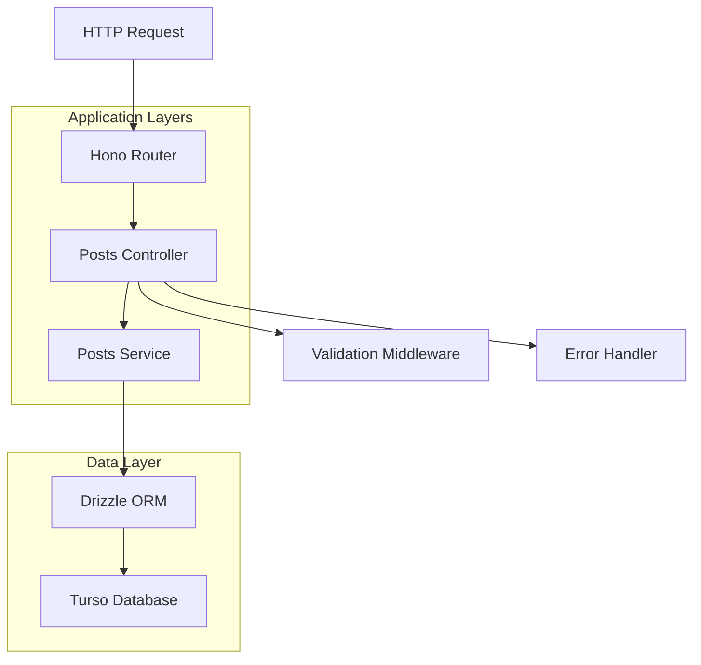

# Design Document

## Overview

The posts CRUD API will be implemented using a layered architecture pattern within the existing Hono framework setup. The design follows separation of concerns with distinct layers for routing, controllers, services, and data access. The API will leverage the existing Drizzle ORM setup with Turso (LibSQL) database and maintain consistency with RESTful conventions.

## Architecture

The system follows a three-layer architecture:

1. **Route Layer**: Defines HTTP endpoints and delegates to controllers
2. **Controller Layer**: Handles HTTP request/response logic and validation
3. **Service Layer**: Contains business logic and database operations
4. **Data Layer**: Drizzle ORM with existing schema definitions



## Components and Interfaces

### 1. Route Definitions

**File**: `src/routes/posts.routes.ts`

Routes will be organized using Hono's routing capabilities:

```typescript
// Route structure
GET    /api/posts           - List posts with pagination/filtering
GET    /api/posts/:id       - Get single post by ID
POST   /api/posts           - Create new post
PUT    /api/posts/:id       - Update existing post
DELETE /api/posts/:id       - Delete post
```

### 2. Controller Interface

**File**: `src/controllers/posts.controller.ts`

The controller will handle HTTP-specific concerns:

```typescript
interface PostsController {
  getAllPosts(c: Context): Promise<Response>;
  getPostById(c: Context): Promise<Response>;
  createPost(c: Context): Promise<Response>;
  updatePost(c: Context): Promise<Response>;
  deletePost(c: Context): Promise<Response>;
}
```

### 3. Service Interface

**File**: `src/services/posts.service.ts`

The service layer will contain business logic:

```typescript
interface PostsService {
  findMany(options: FindManyOptions): Promise<PostWithRelations[]>;
  findById(id: number): Promise<PostWithRelations | null>;
  create(data: CreatePostData): Promise<PostWithRelations>;
  update(id: number, data: UpdatePostData): Promise<PostWithRelations>;
  delete(id: number): Promise<void>;
}
```

### 4. Validation Middleware

**File**: `src/middleware/validation.middleware.ts`

Input validation using Hono's built-in validation or a validation library:

```typescript
interface ValidationSchemas {
  createPost: ValidationSchema;
  updatePost: ValidationSchema;
  queryParams: ValidationSchema;
}
```

## Data Models

### Request/Response DTOs

**Create Post Request**:

```typescript
interface CreatePostRequest {
  title: string;
  content: string;
  description?: string;
  coverImageUrl?: string;
  categoryId: number;
  tagIds?: number[];
  readTime?: string;
}
```

**Update Post Request**:

```typescript
interface UpdatePostRequest {
  title?: string;
  content?: string;
  description?: string;
  coverImageUrl?: string;
  categoryId?: number;
  tagIds?: number[];
  readTime?: string;
}
```

**Post Response**:

```typescript
interface PostResponse {
  id: number;
  title: string;
  slug: string;
  content: string;
  description?: string;
  coverImageUrl?: string;
  readTime?: string;
  publishedAt: Date;
  createdAt: Date;
  updatedAt?: Date;
  author: {
    id: string;
    name: string;
    email: string;
  };
  category: {
    id: number;
    name: string;
    slug: string;
  };
  tags: Array<{
    id: number;
    name: string;
    slug: string;
  }>;
}
```

**Pagination Response**:

```typescript
interface PaginatedPostsResponse {
  data: PostResponse[];
  pagination: {
    page: number;
    limit: number;
    total: number;
    totalPages: number;
  };
}
```

### Query Parameters

**List Posts Query**:

```typescript
interface ListPostsQuery {
  page?: number;
  limit?: number;
  categoryId?: number;
  tagIds?: string; // comma-separated tag IDs
  authorId?: string;
  search?: string; // search in title/content
  sortBy?: "publishedAt" | "createdAt" | "title";
  sortOrder?: "asc" | "desc";
}
```

## Error Handling

### Error Response Format

All errors will follow a consistent format:

```typescript
interface ErrorResponse {
  error: {
    message: string;
    code: string;
    details?: Record<string, string[]>; // For validation errors
  };
}
```

### Error Types

1. **Validation Errors (400)**:

   - Missing required fields
   - Invalid data types
   - Business rule violations

2. **Not Found Errors (404)**:

   - Post not found
   - Referenced entities not found

3. **Conflict Errors (409)**:

   - Duplicate slug
   - Foreign key constraint violations

4. **Server Errors (500)**:
   - Database connection issues
   - Unexpected application errors

### Error Handling Middleware

**File**: `src/middleware/error.middleware.ts`

Centralized error handling that catches and formats all errors consistently.

## Testing Strategy

### Unit Tests

1. **Service Layer Tests**:

   - Test business logic in isolation
   - Mock database operations
   - Test edge cases and error conditions

2. **Controller Tests**:
   - Test HTTP request/response handling
   - Mock service layer
   - Test validation and error responses

### Integration Tests

1. **API Endpoint Tests**:

   - Test complete request/response cycle
   - Use test database
   - Test authentication and authorization

2. **Database Tests**:
   - Test Drizzle ORM queries
   - Test relationship handling
   - Test constraint enforcement

### Test Data Management

- Use database transactions for test isolation
- Create test fixtures for consistent test data
- Mock external dependencies

## Implementation Considerations

### Slug Generation

Implement automatic slug generation from post titles:

- Convert to lowercase
- Replace spaces with hyphens
- Remove special characters
- Ensure uniqueness by appending numbers if needed

### Tag Management

Handle many-to-many relationship between posts and tags:

- Validate tag IDs exist before creating associations
- Replace existing associations on update
- Clean up orphaned associations on delete

### Pagination

Implement cursor-based or offset-based pagination:

- Default limit of 20 posts per page
- Maximum limit of 100 posts per page
- Include total count for UI pagination

### Performance Optimizations

1. **Database Queries**:

   - Use Drizzle's `with` clause for eager loading
   - Implement proper indexing on frequently queried fields
   - Use prepared statements for repeated queries

2. **Response Optimization**:
   - Implement field selection for large responses
   - Consider response caching for read-heavy operations

### Security Considerations

1. **Input Validation**:

   - Sanitize all user inputs
   - Validate data types and constraints
   - Prevent SQL injection through ORM usage

2. **Authorization** (Future Enhancement):
   - Implement role-based access control
   - Ensure users can only modify their own posts
   - Admin-only operations for sensitive actions

## File Structure

```
src/
├── controllers/
│   └── posts.controller.ts
├── services/
│   └── posts.service.ts
├── routes/
│   └── posts.routes.ts
├── middleware/
│   ├── validation.middleware.ts
│   └── error.middleware.ts
├── types/
│   └── posts.types.ts
└── utils/
    ├── slug.utils.ts
    └── pagination.utils.ts
```

This design provides a solid foundation for implementing a robust, maintainable, and scalable posts CRUD API that integrates seamlessly with the existing Hono and Drizzle setup.
